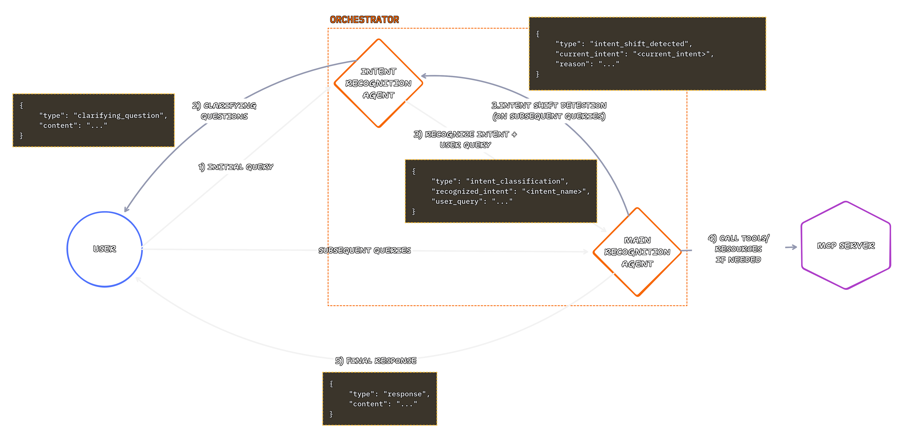

# QnA Action MCP Client

> **Note:** This project is expected to be used with: [QnA Action MCP Server](https://github.com/Faheem-T/qna-action-mcp-server)

The client for the config centered, knowledge powered Q&A and Action MCP Server.

This application provides a terminal-based Chat UI (TUI) to interact with the QnA Action MCP Server. It leverages intents and tools exposed by the server to answer questions and perform actions.

## Features

- **Terminal User Interface (TUI)**: Built with `@opentui/react` for a rich CLI experience.
- **Intent Recognition**: Intelligently routes user queries using an Intent Recognition Agent.
- **MCP Action Support**: Connects to the MCP server to execute tools and retrieve resources.
- **Powered by Gemini**: Uses Google's Gemini models for understanding and generation.

## Prerequisites

- [Bun](https://bun.sh) runtime.
- A running instance of the [qna-action-mcp-server](https://github.com/Faheem-T/qna-action-mcp-server).

## Setup

1.  **Clone the repository** (if you haven't already).
2.  **Install dependencies**:
    ```bash
    bun install
    ```
3.  **Environment Variables**:
    Create a `.env` file in the root directory with the following variables:
    ```env
    MCP_SERVER_URL=http://localhost:3000/sse # URL to your MCP server SSE endpoint
    # GOOGLE_GENAI_API_KEY may be required depending on your Gemini SDK configuration
    ```
    _(Note: `MCP_SERVER_URL` is required per `src/utils/loadEnv.ts`)_

## Usage

Start the client:

```bash
bun start
```

This will launch the TUI. You can then:

- Type your questions or commands in the input box.
- Use `Ctrl + l` to toggle the console logs.
- Use `Tab` to switch focus between the input and the message scrollbox.
- Use `Esc` to return focus to the input box.

## Architecture

The client operates using an Orchestrator pattern:

1.  **Intent Recognition Agent**: Analyzes the user's query to determine the intent.
2.  **Main Agent**: Executes the appropriate action or retrieves information based on the recognized intent, utilizing tools and resources from the connected MCP server.

### Architecture Diagram


